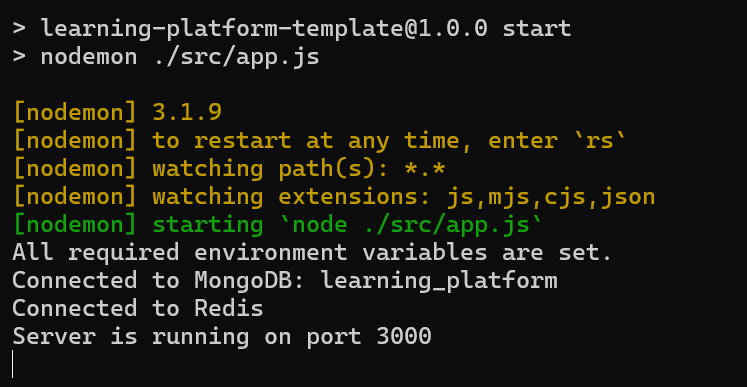
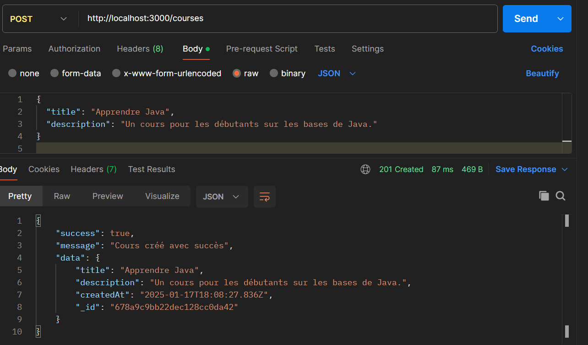
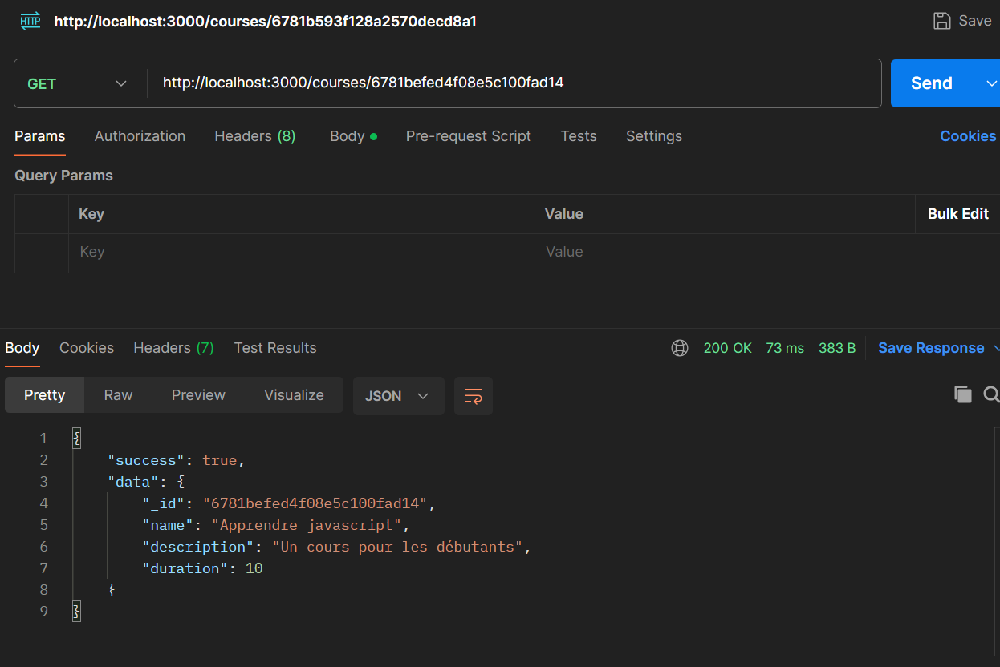
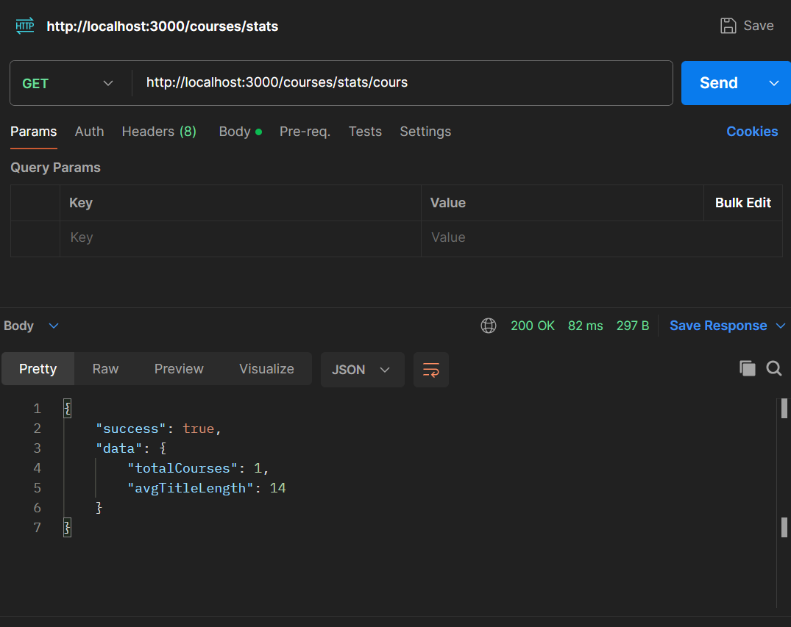

# Projet de fin de module NoSQL : API Backend pour une plateforme d'apprentissage en ligne

## Introduction
Ce projet est une API backend développée pour une plateforme d'apprentissage en ligne, réalisée dans le cadre du module NoSQL. Il illustre une organisation professionnelle du code, tout en mettant en œuvre les meilleures pratiques de développement.

## Prérequis
- [Node.js](https://nodejs.org/)
- [npm](https://www.npmjs.com/)
- [MongoDB](https://www.mongodb.com/)

## Installation et démarrage

1. **Cloner le projet**
   ```bash
   git clone https://github.com/MedBLM588/learning-platform-nosql.git
   cd learning-platform-nosql
   ```

2. **Installer les dépendances**
   ```bash
   npm install
   ```

3. **Configurer les variables d'environnement**
   Créez un fichier `.env` à la racine du projet et ajoutez-y les configurations nécessaires :
   ```env
   DB_URI=mongodb://localhost:27017/learning_platform
   PORT=3000
   JWT_SECRET=votre_secret_jwt
   ```

4. **Lancer le projet**
   ```bash
   npm start
   ```

   Le serveur sera accessible sur [http://localhost:3000](http://localhost:3000).

## Structure du projet
```
learning-platform-nosql/
├── controllers/
│   ├── authController.js
│   └── courseController.js
├── models/
│   ├── User.js
│   └── Course.js
├── routes/
│   ├── authRoutes.js
│   └── courseRoutes.js
├── services/
│   └── authService.js
├── utils/
│   └── errorHandler.js
├── app.js
├── server.js
└── .env.example
```

- **`controllers/`** : Contient les contrôleurs gérant la logique métier.
- **`models/`** : Définit les schémas et modèles MongoDB.
- **`routes/`** : Contient les fichiers de définition des routes.
- **`services/`** : Fournit des services réutilisables pour le projet.
- **`utils/`** : Contient les utilitaires communs, comme la gestion des erreurs.

## Choix techniques
- **Base de données** : MongoDB, pour sa flexibilité et sa facilité d'intégration avec Node.js.
- **Architecture** : Architecture en couches (Routes -> Contrôleurs -> Services -> Modèles).
- **Authentification** : JWT (JSON Web Tokens) pour sécuriser les endpoints protégés.
- **Gestion des erreurs** : Middleware centralisé pour capturer et formater les erreurs.

## Réponses aux questions du dépôt


1. **Pourquoi créer un module séparé pour les connexions aux bases de données ?**
   Pour séparer clairement la logique de connexion (et de  configuration) du reste de l'application, favoriser la réutilisation et la maintenance.

2. **Comment gérer proprement la fermeture des connexions ?**
   En fournissant des fonctions dédiées qui ferment chaque connexion de façon sécurisée et en gérant les événements d'erreur pour éviter les fuites de ressources.

3. **Pourquoi est-il important de valider les variables d'environnement au démarrage ?**
   Pour s’assurer que toutes les configurations critiques (connexion à la base de données, URL, etc.)  sont bien fournies avant que l’application ne se lance.  Cela évite les erreurs tardives et facilite le diagnostic des problèmes.

4. **Que se passe-t-il si une variable requise est manquante ?**
   L’application risque de ne pas fonctionner correctement (erreur de connexion à la base de données, fonctionnalités indisponibles, etc.). Il est préférable de lever une exception au démarrage afin de signaler immédiatement le problème et empêcher l’exécution   dans un état instable. 

5. **Quelle est la différence entre un contrôleur et une route ?**
  - Une route définit l'URL et la méthode HTTP (GET, POST, etc.).
  - Un contrôleur contient la logique métier qui s'exécute lorsque la route est appelée.

6. **Pourquoi séparer la logique métier des routes ?**
   - Pour garder un code plus lisible et modulaire :
      + Les routes définissent seulement l'URL et la méthode.
      + Les contrôleurs gèrent la logique de traitement.

7. **Pourquoi séparer les routes dans différents fichiers**
  - Pour garder une meilleure lisibilité et organisation du projet : chaque module/fonctionnalité possède ses propres routes, ce qui facilite la maintenance et l’évolution du code.

8. **Comment organiser les routes de manière cohérente ?**
   - En regroupant les endpoints par domaine/fonctionnalité (ex. courses, users, auth, etc.), et en utilisant des noms d’URL explicites qui reflètent l’action ou la ressource manipulée.

9. **Pourquoi créer des services séparés ?**
   Pour séparer la logique d'accès aux données (niveau bas) de la logique métier (controllers). Cela rend le code plus modulaire, maintenable et réutilisable.

10. **Comment gérer efficacement le cache avec Redis ?**
   - Définir un TTL (Time To Live) approprié pour limiter la taille du cache.
   - Invalider ou rafraîchir régulièrement les données expirées.
   - Choisir la bonne stratégie (write-through, write-back, etc.) selon le cas d'utilisation.

11. **Quelles sont les bonnes pratiques pour les clés Redis ?**
   - Utiliser un préfixe explicite (ex. "user:", "course:") pour organiser les données.
   - Employer un TTL adapté pour chaque type de donnée.
   - Maintenir une structure cohérente (ex. user:123:session).

12. **Comment organiser le point d'entrée de l'application ?**
   -  En rassemblant : la configuration (variables d'environnement),  la connexion aux bases de données, la configuration d'Express (middlewares), et l'initialisation des routes dans un seul fichier central.

13. **Quelle est la meilleure façon de gérer le démarrage de l'application ?**
   - En plaçant toutes les opérations critiques (connexion BDD, config) dans un try/catch pour gérer les erreurs dès le lancement. Écouter aussi les signaux système (SIGTERM, SIGINT) pour fermer proprement les connexions et éviter les fuites de ressources.


## Fonctionnalités principales
- Inscription et connexion des utilisateurs (authentification JWT).
- Gestion des cours :
  - Ajouter un cours.
  - Lister les cours disponibles.
  - Détails d'un cours spécifique.

## Tests Effectués

#### 1 - Lancement du Serveur


#### 2 - Les cours créer


#### 3 - Détails d'un cours


#### 4 - Les statistiques


## Auteur
- **Mohamed BOULAALAM**